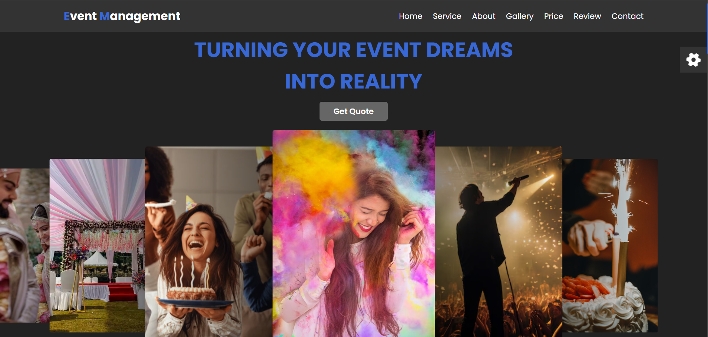

# 🎉 Event Management Website

A modern and responsive **Event Management Website** built using **HTML, CSS, and JavaScript**. The website provides an elegant interface for showcasing event planning services, galleries, pricing plans, customer reviews, and contact information.

<p align="center">
  
  
  
  
</p>

---

## 🚀 Live Demo

👉 **https://anurag-rathod.github.io/event-management-website-/**

---

## 📖 About

This project is a responsive Event Management Website designed to showcase event planning services in a visually appealing way.

It includes:

- Attractive Landing Page
- Event Services Section
- About Us
- Image Gallery
- Pricing Plans
- Customer Reviews
- Contact Form
- Theme Color Switcher
- Responsive Design

---

## ✨ Features

- 🎉 Modern and Attractive UI
- 📱 Fully Responsive Design
- 🎨 Multiple Theme Colors
- 🖼 Beautiful Image Gallery
- 💼 Event Service Showcase
- 💰 Pricing Plans
- ⭐ Client Testimonials
- 📞 Contact Form
- ⚡ Smooth Navigation
- 🎡 Swiper Image Slider
- 🎯 Clean and Organized Code

---

## 🛠 Tech Stack

- HTML5
- CSS3
- JavaScript
- Swiper.js
- Font Awesome

---

## 📂 Folder Structure

```text
Event-Management-Website/
│── index.html
│── styles.css
│── app.js
│── images/
│── screenshot.png
```

---

## ▶️ Getting Started

### 1️⃣ Clone the Repository

```bash
git clone https://github.com/Anurag-Rathod/event-management-website-.git
```

### 2️⃣ Open Project Folder

```text
Event-Management-Website
```

### 3️⃣ Run the Project

Simply open **index.html** in your browser.

---

## 📸 Project Preview

> Upload your homepage screenshot as **screenshot.png** in the project root.

```md

```

---

## 🌟 Future Improvements

- 📅 Online Event Booking
- 💳 Payment Integration
- 👤 User Login & Registration
- 📧 Email Notifications
- 📍 Google Maps Integration
- 🗂 Admin Dashboard

---

## 👨‍💻 Author

**Anurag Rathod**

🔗 GitHub  
https://github.com/Anurag-Rathod

🌐 Live Website  
https://anurag-rathod.github.io/event-management-website-/

---

## 📜 License

This project is created for learning and portfolio purposes.
